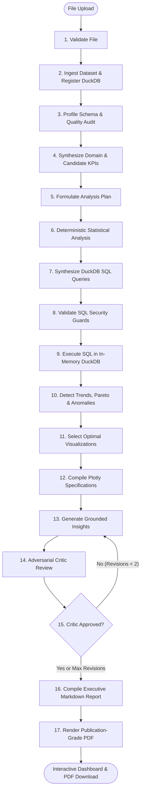

# DataPilot:Multi-Agent Data Analyst

### AI-Powered CSV & Excel Insight & Executive Report Generator

An enterprise-grade, full-stack multi-agent data analysis application built with **LangGraph**, **DuckDB**, **FastAPI**, **React**, and **Plotly**. The system ingests structured datasets, executes deterministic statistical computing and safe SQL queries, discovers anomalies, synthesizes evidence-grounded insights through an adversarial critic loop, and produces an interactive executive dashboard and publication-ready PDF download.

---

## Key Features

- **17-Node Sequential Multi-Agent Architecture**: Built with LangGraph StateGraph, combining deterministic computation (DuckDB, pandas, numpy, scipy) with LLM reasoning.
- **Strict Data Minimization & PII Redaction**: Full datasets are never sent to external LLMs. LLMs only receive compact statistical moments, metadata, and regex-redacted sample values.
- **SQL Security & Injection Guards**: AST and keyword validator enforces read-only `SELECT` / `WITH` statements, rejecting mutating statements, multi-query injections, and file access.
- **Deterministic Statistics & Patterns**: Calculates moments (mean, std, variance, skewness, kurtosis), quantiles (P10, P25, median, P75, P90, IQR), Pearson/Spearman correlations with p-values, One-Way ANOVA F-tests, and Pareto 80/20 concentrations.
- **Adversarial Critic Loop**: Audits every generated insight against ground-truth tables, rejects unproven causal assertions, and enforces a hard cap of maximum 2 revision iterations.
- **Interactive Visualizations & PDF Export**: Produces interactive Plotly charts and publication-grade multi-page PDFs using ReportLab.
- **Real-Time Progress Streaming**: Emits live Server-Sent Events (SSE) as each agent executes with live status previews.

---

## 17-Node Pipeline Architecture



---

## Quickstart: How to Run the Project

### Prerequisites
- **Python**: 3.11 or 3.12 installed
- **Node.js**: v18+ and npm installed

---

### Step 1: Start the Backend Server

1. Open a terminal in the project root directory:
   ```bash
   cd backend
   ```

2. Activate the existing virtual environment:
   - **Windows (PowerShell)**:
     ```powershell
     .\venv\Scripts\Activate.ps1
     ```
   - **Windows (Command Prompt)**:
     ```cmd
     .\venv\Scripts\activate.bat
     ```
   - **Linux / macOS**:
     ```bash
     source venv/bin/activate
     ```

3. Ensure configuration `.env` is present in `backend/.env`:
   ```bash
   # Copy template if not already present
   cp .env.example .env
   ```
   *(Note: The system supports Groq and Google Gemini API keys. If no keys are provided or keys are on rate-limit cooldown, the built-in deterministic offline engine executes automatically!)*

4. Launch the FastAPI development server:
   ```bash
   uvicorn app.main:app --reload --host 0.0.0.0 --port 8000
   ```
   - API Docs will be available at: [http://localhost:8000/docs](http://localhost:8000/docs)
   - Health Check: [http://localhost:8000/api/health](http://localhost:8000/api/health)

---

### Step 2: Start the Frontend Application

1. Open a second terminal window in the project root directory:
   ```bash
   cd frontend
   ```

2. Ensure dependencies are installed:
   ```bash
   npm install
   ```

3. Start the Vite development server:
   ```bash
   npm run dev
   ```

4. Open your browser and navigate to:
   ```
   http://localhost:5173
   ```

---

## Testing with Sample Datasets

The project includes pre-built synthetic datasets in the `samples/` directory:

1. **Clean E-Commerce Dataset** (`samples/clean_dataset.csv`):
   - 20 retail transaction records across 4 product categories and regions.
   - Ideal for testing standard KPI computation, correlations, and clean PDF generation.
2. **Clean Excel Workbook** (`samples/clean_dataset.xlsx`):
   - Multi-column spreadsheet verifying openpyxl integration.
3. **Messy Outlier Dataset** (`samples/messy_dataset.csv`):
   - Contains negative quantities, missing values, duplicate records, and extreme numerical outliers (e.g. $45M revenue on a chair) to demonstrate data quality degradation scoring and anomaly isolation.

*You can test these either by clicking the **"Quick Start with Sample Data"** buttons directly on the web interface or by dragging and dropping your own CSV / Excel files.*

---

## Running the Automated Test Suite

Run the full pytest suite (54 automated tests covering health, ingestion, profiling, quality, LLM router, statistics, SQL security, pattern detection, visualizations, insights, critic review, revision loops, LangGraph state graph, SSE streaming, and end-to-end pipelines):

```bash
# In backend/ directory with venv activated:
pytest tests/ -v
```

---

## API Endpoints Reference

| Method | Endpoint | Description |
|---|---|---|
| `GET` | `/api/health` | Service health status and version info |
| `POST` | `/api/upload` | Uploads, sanitizes, and registers CSV/Excel into DuckDB |
| `GET` | `/api/dataset/{id}/profile` | Returns column statistics, quantiles, and semantic types |
| `GET` | `/api/dataset/{id}/quality` | Returns 0-100 quality score, grade, and audit issues |
| `POST` | `/api/analyze/stream` | Multi-part upload streaming real-time 17-agent SSE events |
| `GET` | `/api/dataset/{id}/report` | Retrieves complete compiled analysis report JSON |
| `GET` | `/api/dataset/{id}/report/pdf` | Streams downloadable publication-ready PDF binary |
