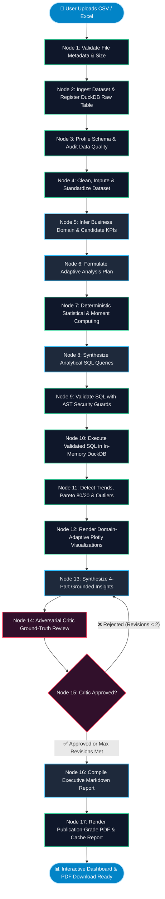

# DataPilot: Multi-Agent AI Data Analysis & Executive Report Generator

<div align="center">

[](https://www.python.org/)
[](https://fastapi.tiangolo.com/)
[](https://github.com/langchain-ai/langgraph)
[](https://duckdb.org/)
[](https://react.dev/)
[](https://vitejs.dev/)
[](https://plotly.com/)
[](https://tailwindcss.com/)
[-brightgreen?style=for-the-badge&logo=pytest&logoColor=white)](https://docs.pytest.org/)
[](LICENSE)

<p align="center">
  <strong>An enterprise-grade, privacy-first, 17-agent automated data analysis platform.</strong><br>
  Transforms raw CSV and Excel datasets into sanitized tables, deterministic statistical foundations, audited SQL queries, domain-adaptive Plotly dashboards, adversarial-critic-verified insights, and publication-ready multi-page PDF reports in seconds.
</p>

[Key Features](#-key-features) • [Architecture Pipeline](#-17-node-pipeline-architecture) • [Live Dashboard Tour](#-interactive-dashboard-features) • [Installation & Setup](#-installation--quickstart-guide) • [API Reference](#-api-endpoints-reference) • [Privacy & Security](#-security--data-privacy-blueprint) • [Automated Tests](#-testing--quality-assurance)

---

</div>

## 📌 Overview

**DataPilot** is a production-ready, full-stack multi-agent data intelligence assistant. Built with **LangGraph**, **FastAPI**, **DuckDB**, **SciPy**, **React**, and **Plotly**, DataPilot eliminates the common pitfalls of raw Large Language Models (hallucinations, PII leaks, unverified claims, and incorrect math) by enforcing a strict **hybrid deterministic-adversarial architecture**:

1. **Deterministic Computation First**: All numbers, statistics, distributions, correlations, and SQL aggregations are computed directly on an in-memory DuckDB engine and SciPy statistical routines.
2. **Zero Raw-Data Leakage**: External LLMs never receive row-level data. Prompts receive only sanitized statistical moments, metadata schemas, and regex-redacted sample values.
3. **Adversarial Critic Loop**: Every synthesized insight is cross-examined by an independent Critic Agent that validates numerical assertions against ground-truth tables, rejecting hallucinations and enforcing grounded business recommendations.
4. **Autonomous Data Sanitization**: Evaluates data hygiene (0–100 quality score), flags critical anomalies, applies intelligent imputation and outlier clamping, and generates sanitized CSV and styled Excel downloads.
5. **Real-Time Streaming UX**: Emits Server-Sent Events (SSE) across all 17 agent nodes to provide instant live feedback on execution state, timing, and intermediate deliverables.

---

## ⚡ Comparison: Traditional LLM vs. DataPilot

| Feature | Raw LLM Analysis (e.g. Chatbot) | Traditional BI Tools (Tableau / PowerBI) | **DataPilot Multi-Agent Assistant** |
|---|---|---|---|
| **Calculation Accuracy** | ❌ Prone to math hallucinations | ✅ Deterministic calculations | ⭐️ **100% Deterministic (DuckDB + SciPy)** |
| **Data Privacy & PII** | ❌ Full dataset uploaded to cloud | ✅ Local storage / database connection | ⭐️ **Zero Data Leakage (Moments & Redacted Metadata Only)** |
| **SQL Safety** | ❌ May generate destructive SQL | ⚠️ Requires manual query crafting | ⭐️ **AST-Validated Read-Only SQL Execution Guard** |
| **Insight Verification** | ❌ Unchecked causal assertions | ❌ Manual analyst interpretation required | ⭐️ **Adversarial Critic Verification Loop (Max 2 Cycles)** |
| **Data Cleaning** | ❌ Manual or naive script | ⚠️ Complex manual transformation pipelines | ⭐️ **Automated Sanitization, Imputation & Excel/CSV Export** |
| **Execution Transparency** | ❌ Black-box waiting screen | N/A | ⭐️ **17-Node Live SSE Pipeline Tracker** |
| **Reporting** | ❌ Plain copy-paste text | ⚠️ Manual dashboard design | ⭐️ **Interactive Plotly Suite + Publication-Ready PDF** |

---

## 🚀 Key Features

### 🧠 17-Node Orchestrated Multi-Agent Pipeline
- Powered by **LangGraph StateGraph** combining deterministic Python engines with cognitive LLM agents.
- Coordinated sequential execution with conditional revision loops and structured state propagation.

### 🛡️ Strict Zero-Data Leakage & PII Redaction
- Row-level customer data never touches external APIs.
- Regex heuristics automatically mask emails, phone numbers, SSNs, credit card numbers, and secret API keys before sending metadata to LLMs.

### 🔒 AST-Grounded SQL Security Guard
- Custom SQL validator parses queries with strict keyword checks and Abstract Syntax Tree (AST) validation.
- Restricts queries strictly to read-only `SELECT` and `WITH` statements.
- Blocks destructive mutations (`DROP`, `DELETE`, `UPDATE`, `ALTER`, `INSERT`), file system operations, and multi-query injection chaining.

### 📊 Deep Deterministic Statistical Engine
- **Moments**: Mean, standard deviation, variance, skewness, kurtosis.
- **Quantiles**: P10, P25, P50 (median), P75, P90, and Interquartile Range (IQR).
- **Multivariate Correlation**: Pearson and Spearman rank correlation matrices with 2-tailed p-values.
- **Hypothesis Testing**: One-Way ANOVA F-tests across categorical groupings.
- **Pareto Principle (80/20 rule)**: Cumulative frequency distribution analysis to isolate top drivers.

### 🧹 Comprehensive Data Cleaning & Hygiene Suite
- 0–100 Data Quality Health Score with categorical grade badges (A+, A, B, C, D, F).
- Missing value imputation (median for skewed numerics, mean for normal, mode/unknown for categoricals).
- Deduplication of redundant rows and header standardization (snake_case conversion).
- Instant one-click download of sanitized **CSV** and styled **Excel (.xlsx)** datasets.

### ⚖️ Adversarial Critic Review & Self-Correction Loop
- Insight generation is split into generation and verification.
- The Critic Agent evaluates every insight against calculated statistics and SQL results.
- If unsupported claims, numerical mismatches, or ungrounded causal claims are detected, the critic rejects the draft and initiates a revision cycle (capped at 2 iterations).

### 📈 Interactive Plotly Visualizations & Publication PDF
- Automatically selects the most informative chart types: Distribution Histograms, Time-Series Line Trends, Pareto 80/20 Bar Charts, OLS Scatter Correlations, Category Breakdown Pies/Donuts, and Boxplots.
- Renders publication-grade multi-page PDF executive summaries using **ReportLab** with headers, footers, KPI tables, and high-resolution chart embeds.

---

## 🔄 17-Node Pipeline Architecture

The entire ingestion-to-report lifecycle runs through a specialized LangGraph directed acyclic graph (DAG) with a conditional adversarial critique loop:



---

## 🧩 Pipeline Step-by-Step Breakdown

```
 ┌───────────────────────────────────────────────────────────────────────────────────────────┐
 │                                   DATAPILOT 17-AGENT PIPELINE                             │
 └───────────────────────────────────────────────────────────────────────────────────────────┘
   [01] File Validation      ──► Sanitizes filename, validates MIME type, verifies 10MB limit
   [02] Dataset Ingestion    ──► Decodes CSV/Excel, registers in-memory table in DuckDB
   [03] Quality Audit        ──► Computes completeness, null counts, duplicate ratios, health score
   [04] Data Cleaning        ──► Performs imputation, header snake_casing, outlier clamping
   [05] Domain Understanding ──► Infers entity domain (E-Commerce, Finance, Healthcare, etc.)
   [06] Analysis Planning    ──► Prioritizes statistical tests and domain-specific analytical queries
   [07] Statistical Engine   ──► Calculates moments, distributions, correlations & ANOVA F-tests
   [08] SQL Generation       ──► Synthesizes aggregate DuckDB SQL queries targeting strategic KPIs
   [09] Security Validation  ──► AST parser blocks mutations, sub-queries, and file operations
   [10] SQL Execution        ──► Executes queries on DuckDB and formats results with timing metrics
   [11] Pattern Detection    ──► Evaluates linear trends, Pareto 80/20 shares, and IQR anomalies
   [12] Visualizations       ──► Generates interactive Plotly JSON specs with responsive dark styling
   [13] Insight Generation   ──► Synthesizes 4-part evidence-backed observations and recommendations
   [14] Critic Review        ──► Verifies all claims against computed statistical and SQL numbers
   [15] Revision Router      ──► Self-corrects unverified claims (up to 2 iterative loops)
   [16] Report Compilation   ──► Synthesizes comprehensive executive Markdown documentation
   [17] PDF Rendering        ──► Generates publication-ready multi-page PDF report with embeds
```

---

## 🖥️ Interactive Dashboard Features

The DataPilot user interface is built as a dark-mode, high-productivity workspace organized into 7 distinct analytical tabs:

```
┌─────────────────────────────────────────────────────────────────────────────────────────────┐
│ DataPilot Executive Analytics Workspace                                                     │
├─────────────┬─────────────┬─────────────┬─────────────┬─────────────┬─────────────┬─────────┤
│ 📊 Overview │ 🧹 Cleaned  │ 🛡️ Quality  │ 📈 Stats    │ 📉 Visuals  │ 💡 Insights │ 📄 Rep  │
└─────────────┴─────────────┴─────────────┴─────────────┴─────────────┴─────────────┴─────────┘
```

### 1. 📊 Executive Overview Tab
- **High-Level KPI Cards**: Total records, total columns, detected domain, and primary business metrics.
- **Domain & Scope Synthesis**: High-level analytical scope and candidate metrics identified by the understanding agent.
- **Quick Action Bar**: One-click shortcuts to download the PDF report, export sanitized data, or trigger targeted natural language queries.

### 2. 🧹 Cleaned Data Suite Tab
- **Data Transformation Log**: Detailed breakdown of missing values imputed, duplicates removed, and columns normalized.
- **Interactive Data Table Preview**: Dynamic 20-row preview of the sanitized dataset with sorting and formatting.
- **Export Options**: One-click download of the transformed dataset as clean **CSV** or styled **Excel (.xlsx)**.

### 3. 🛡️ Data Quality & Health Tab
- **Quality Score Meter**: Dynamic circular health gauge (0–100) with grade classification (A+ through F).
- **Issue Audit Matrix**: Severity-classified issue cards (Critical, Warning, Info) detailing data hygiene violations.
- **Column-by-Column Completeness**: Interactive bar breakdowns showing fill rates, unique ratios, and detected data types.

### 4. 📈 Statistical Analysis Tab
- **Parametric & Non-Parametric Moments**: Mean, variance, standard deviation, skewness, and kurtosis.
- **Quantile Ranges**: P10, P25, Median, P75, P90, and IQR for all continuous variables.
- **Correlation Heatmap & Tables**: Interactive Pearson & Spearman correlation coefficients with statistical significance ($p$-values).
- **ANOVA Hypothesis Tests**: Between-group variance analysis isolating high-impact categorical drivers.

### 5. 📉 Interactive Visualizations Tab
- Powered by **Plotly.js** with full zoom, pan, tooltip inspection, and PNG export.
- Dynamic layout containing:
  - **Distribution Plots**: Numerical spread histograms with overlaid mean and median markers.
  - **Time-Series Trends**: Temporal progression lines with trendline projections.
  - **Pareto 80/20 Charts**: Cumulative contribution curves highlighting vital top segments.
  - **Correlation Scatter Plots**: Multi-variable scatter plots with OLS linear trendlines.
  - **Category Breakdowns**: Donut and bar charts showing segment distributions.

### 6. 💡 Evidence-Grounded Insights Tab
Every insight is structured in an enterprise 4-part framework:
- **Observation**: Clear factual statement of what was discovered.
- **Evidence**: Exact mathematical metrics, SQL query outputs, or correlation coefficients.
- **Business Impact**: Strategic, financial, or operational consequences.
- **Actionable Recommendation**: Pragmatic next steps with expected outcome.
- **Critic Verification Stamp**: Confidence rating badge confirming evidence validation.

### 7. 📄 Executive Markdown & PDF Report Tab
- **Rendered Markdown Viewer**: Complete structured briefing document with collapsible sections and copy-to-clipboard functionality.
- **Downloadable PDF Report**: Streams an executive multi-page document rendered with custom headers, page numbering, KPI summary tables, and chart images.

### 8. 🕒 History Drawer & Real-Time SSE Tracker
- **Session History Sidebar**: Instant switching between analyzed datasets without re-uploading.
- **Live SSE Tracker**: Step-by-step progress modal displaying active agents, elapsed timing, and completed deliverables.

---

## 🛠️ Technology Stack

### Backend
| Layer | Technologies |
|---|---|
| **Language & Framework** | Python 3.11 / 3.12, FastAPI 0.110+, Uvicorn |
| **Multi-Agent Orchestration** | LangGraph 0.0.30+, StateGraph |
| **In-Memory Analytical DB** | DuckDB 0.10+ |
| **Data Processing & Stats** | Pandas 2.2+, NumPy 1.26+, SciPy 1.12+ |
| **PDF Generation Engine** | ReportLab 4.1+ |
| **LLM Provider Integration** | Groq (Llama-3.3-70B-Versatile), Google Gemini (Gemini-2.5-Flash), Built-in Deterministic Mock Engine |
| **Spreadsheet Processing** | OpenPyXL 3.1+ |
| **Testing & Verification** | Pytest 8.0+, Pytest-Asyncio, HTTPX |

### Frontend
| Layer | Technologies |
|---|---|
| **Framework & Core** | React 18.2, Vite 5.1 (ES Modules) |
| **Interactive Charting** | Plotly.js (`plotly.js-dist-min`, `react-plotly.js`) |
| **Styling & UI Design** | TailwindCSS 3.4, Custom Glassmorphism, CSS Variables |
| **Animations & Icons** | Framer Motion 11.0+, Lucide React |
| **Communication** | Fetch API, Server-Sent Events (`EventSource`) |

---

## 📂 Project Structure

```
multi-agent-ai-data-analysis-assistant/
├── backend/
│   ├── app/
│   │   ├── agents/                   # LLM & Cognitive Agent Implementations
│   │   │   ├── understand_dataset.py # Node 5: Domain & KPI inference
│   │   │   ├── plan_analysis.py      # Node 6: Adaptive analysis planning
│   │   │   ├── generate_sql.py       # Node 8: DuckDB SQL query synthesis
│   │   │   ├── generate_insights.py  # Node 13: 4-part evidence-grounded insights
│   │   │   ├── critic_review.py      # Node 14: Adversarial evidence validator
│   │   │   ├── revise_insights.py    # Node 15: Revision loop controller
│   │   │   └── generate_report.py    # Node 16: Executive markdown compilation
│   │   ├── api/                      # FastAPI Routers & Endpoints
│   │   │   ├── routes/
│   │   │   │   ├── health.py         # System health & status check
│   │   │   │   ├── upload.py         # File ingestion & DuckDB registration
│   │   │   │   ├── analysis.py       # SSE real-time multi-agent stream
│   │   │   │   ├── profile.py        # Schema & quality endpoints
│   │   │   │   └── report.py         # Report retrieval, PDF streaming & CSV export
│   │   ├── core/                     # Configuration, Settings & Logging
│   │   │   ├── config.py             # Pydantic environment configuration
│   │   │   ├── logging.py            # Structured system logger
│   │   │   └── exceptions.py         # Custom application exception handlers
│   │   ├── llm/                      # Multi-Provider LLM Gateway
│   │   │   ├── router.py             # Failover, pool management & cooldown tracking
│   │   │   ├── groq_provider.py      # Groq API client
│   │   │   ├── gemini_provider.py    # Google Gemini API client
│   │   │   ├── mock_provider.py      # Offline deterministic fallback engine
│   │   │   └── privacy.py            # PII heuristic regex redaction filter
│   │   ├── models/                   # Pydantic Schemas & Data Contracts
│   │   │   ├── profile.py            # Schema, column & dataset profiles
│   │   │   ├── quality.py            # Quality audit scores & issues
│   │   │   ├── patterns.py           # Trends, Pareto shares & anomalies
│   │   │   ├── insights.py           # Structured 4-part insight schemas
│   │   │   └── report.py             # Comprehensive report schema
│   │   ├── orchestration/            # LangGraph Pipeline & State Machine
│   │   │   ├── graph.py              # 17-Node StateGraph workflow & edges
│   │   │   ├── state.py              # AnalysisWorkflowState type definition
│   │   │   └── events.py             # SSE event schemas & step metadata
│   │   ├── services/                 # Deterministic Computational Engines
│   │   │   ├── ingestion/            # File loading & DuckDB registration
│   │   │   ├── cleaning/             # Imputation, deduplication & exports
│   │   │   ├── profiling/            # Type inference & moment profiling
│   │   │   ├── quality/              # Data health scoring algorithm
│   │   │   ├── statistics/           # SciPy statistical compute engine
│   │   │   ├── sql/                  # AST security validator & DuckDB executor
│   │   │   ├── patterns/             # Trend, Pareto & anomaly detectors
│   │   │   ├── visualization/        # Domain-adaptive Plotly generator
│   │   │   └── reporting/            # ReportLab PDF & Markdown generator
│   │   └── main.py                   # FastAPI Application Root & CORS Configuration
│   ├── tests/                        # 54 Comprehensive Automated Tests
│   ├── requirements.txt              # Python Dependencies
│   └── .env.example                  # Environment Configuration Template
├── frontend/
│   ├── src/
│   │   ├── components/               # React UI Components
│   │   │   ├── PipelineTracker.jsx   # Real-time 17-agent SSE progress modal
│   │   │   ├── OverviewTab.jsx       # Executive summary & domain metrics
│   │   │   ├── CleanDataTab.jsx      # Data cleaning dashboard & CSV/Excel export
│   │   │   ├── DataQualityTab.jsx    # Health score meter & quality issues
│   │   │   ├── StatisticsTab.jsx     # Distributions, moments & correlation heatmap
│   │   │   ├── VisualizationsTab.jsx # Plotly interactive chart suite
│   │   │   ├── ChartRenderer.jsx     # Responsive Plotly container
│   │   │   ├── InsightsTab.jsx       # 4-part verified insights & critic badge
│   │   │   ├── ReportMarkdownTab.jsx # Markdown report viewer & PDF download
│   │   │   ├── HistorySidebar.jsx    # Dataset analysis history drawer
│   │   │   └── ErrorBoundary.jsx     # Graceful UI failure boundary
│   │   ├── App.jsx                   # Main Workspace Controller & Navigation
│   │   ├── main.jsx                  # React DOM Entrypoint
│   │   └── index.css                 # Custom Styling & Glassmorphism Tokens
│   ├── package.json                  # Node.js Dependencies & Scripts
│   ├── tailwind.config.js            # Tailwind Configuration
│   └── vite.config.js                # Vite Server Configuration
└── samples/                          # Sample Datasets for Testing & Demos
    ├── clean_dataset.csv             # E-Commerce transaction dataset (Clean)
    ├── clean_dataset.xlsx            # Multi-column Excel spreadsheet (Clean)
    └── messy_dataset.csv             # Outlier & missing-value dataset (Dirty)
```

---

## 💻 Installation & Quickstart Guide

### Prerequisites
Make sure you have the following installed on your machine:
- **Python**: Version `3.11` or `3.12` ([Download Python](https://www.python.org/downloads/))
- **Node.js**: Version `18.0+` or `20.0+` with npm ([Download Node.js](https://nodejs.org/))
- **Git**: For cloning the repository ([Download Git](https://git-scm.com/))

---

### Step 1: Clone the Repository

```bash
git clone https://github.com/your-username/multi-agent-ai-data-analysis-assistant.git
cd multi-agent-ai-data-analysis-assistant
```

---

### Step 2: Configure & Start the Backend

1. Navigate to the `backend/` directory:
   ```bash
   cd backend
   ```

2. Create and activate a Python virtual environment:
   - **Windows (PowerShell)**:
     ```powershell
     python -m venv venv
     .\venv\Scripts\Activate.ps1
     ```
   - **Windows (Command Prompt)**:
     ```cmd
     python -m venv venv
     .\venv\Scripts\activate.bat
     ```
   - **Linux / macOS**:
     ```bash
     python3 -m venv venv
     source venv/bin/activate
     ```

3. Install required Python packages:
   ```bash
   pip install --upgrade pip
   pip install -r requirements.txt
   ```

4. Set up your environment variables:
   ```bash
   # Copy the example environment template
   cp .env.example .env
   ```

   Open `.env` in any text editor and configure your preferences:
   ```ini
   APP_ENV=development
   LOG_LEVEL=INFO
   HOST=0.0.0.0
   PORT=8000

   # File Upload Limits
   MAX_UPLOAD_SIZE_MB=10
   MAX_DATASET_ROWS=500000
   MAX_DATASET_COLUMNS=500

   # Optional LLM API Keys (Groq / Gemini)
   GROQ_API_KEY_1=your_groq_api_key_here
   GROQ_MODEL=llama-3.3-70b-versatile

   GEMINI_API_KEY_1=your_gemini_api_key_here
   GEMINI_MODEL=gemini-2.5-flash

   # CORS Allowed Origins
   CORS_ORIGINS=["http://localhost:5173","http://localhost:3000","http://127.0.0.1:5173"]
   ```

   > [!NOTE]
   > **Offline Mode**: If you do not provide Groq or Gemini API keys, DataPilot automatically switches to its built-in **Deterministic Mock Engine**. You can run and test all 17 agents offline with zero external API costs!

5. Start the FastAPI development server:
   ```bash
   uvicorn app.main:app --reload --host 0.0.0.0 --port 8000
   ```

   - **Interactive Swagger Docs**: [http://localhost:8000/docs](http://localhost:8000/docs)
   - **ReDoc Documentation**: [http://localhost:8000/redoc](http://localhost:8000/redoc)
   - **Health Check Endpoint**: [http://localhost:8000/api/health](http://localhost:8000/api/health)

---

### Step 3: Configure & Start the Frontend

1. Open a **new terminal window** and navigate to the `frontend/` directory:
   ```bash
   cd frontend
   ```

2. Install Node.js dependencies:
   ```bash
   npm install
   ```

3. Start the Vite local development server:
   ```bash
   npm run dev
   ```

4. Open your browser and navigate to:
   ```
   http://localhost:5173
   ```

---

## 🧪 Testing with Sample Datasets

The repository includes pre-packaged test datasets located in `samples/`:

| Dataset | File Path | Characteristics & Test Focus |
|---|---|---|
| **E-Commerce Transactions (Clean)** | [`samples/clean_dataset.csv`](file:///e:/GenAI-Projects/multi-agent-ai-data-analysis-assistant/samples/clean_dataset.csv) | 20 transaction records across product categories, revenues, quantities, and discounts. Ideal for testing KPI benchmarks, correlation matrices, and clean PDF generation. |
| **Spreadsheet Workbook (Clean)** | [`samples/clean_dataset.xlsx`](file:///e:/GenAI-Projects/multi-agent-ai-data-analysis-assistant/samples/clean_dataset.xlsx) | Multi-column Excel spreadsheet verifying `openpyxl` ingestion and type inference. |
| **Anomalous Dataset (Dirty)** | [`samples/messy_dataset.csv`](file:///e:/GenAI-Projects/multi-agent-ai-data-analysis-assistant/samples/messy_dataset.csv) | Contains negative quantities, missing revenue values, duplicate customer rows, and extreme numerical outliers ($45M revenue on a $200 item). Tests automated imputation, outlier clamping, and quality degradation scoring. |

> [!TIP]
> You can immediately test these datasets by clicking the **"Quick Start with Sample Data"** buttons located directly under the file upload box on the web interface!

---

## 📡 API Endpoints Reference

### Core Endpoints

| Method | Route | Description | Request / Response |
|---|---|---|---|
| `GET` | `/api/health` | Service health status and version info | Returns `{"status": "ok", "version": "1.0.0"}` |
| `POST` | `/api/upload` | Ingests, validates, and registers a CSV/Excel file in DuckDB | `multipart/form-data` -> `UploadResponse` |
| `POST` | `/api/analyze/stream` | Multi-part upload streaming real-time 17-agent SSE events | `multipart/form-data` -> `text/event-stream` |
| `GET` | `/api/dataset/{id}/profile` | Retrieves column schema, data types, and statistical moments | Returns `DatasetProfile` JSON |
| `GET` | `/api/dataset/{id}/quality` | Retrieves 0–100 quality score, grade, and audit issue cards | Returns `DataQualityReport` JSON |
| `GET` | `/api/dataset/{id}/report` | Retrieves complete compiled analysis report JSON | Returns `AnalysisReport` JSON |
| `GET` | `/api/dataset/{id}/report/pdf` | Streams downloadable publication-ready PDF binary | Returns `application/pdf` binary stream |
| `POST` | `/api/dataset/report/pdf` | Converts an `AnalysisReport` JSON payload directly into a PDF | Body: `AnalysisReport` -> Returns PDF binary |
| `GET` | `/api/dataset/{id}/cleaned-preview` | Returns top 20 rows and transformation summary of cleaned data | Returns preview rows and cleaning stats |
| `GET` | `/api/dataset/{id}/download/cleaned-csv` | Streams the sanitized and imputed dataset as a CSV file | Returns `text/csv` attachment |
| `GET` | `/api/dataset/{id}/download/cleaned-excel`| Streams the sanitized and formatted dataset as an Excel file | Returns `.xlsx` binary attachment |
| `GET` | `/api/dataset/history` | Retrieves list of all analyzed datasets in the active session | Returns array of dataset summaries |
| `DELETE` | `/api/dataset/{id}` | Deletes a dataset analysis and cleans up in-memory DuckDB tables | Returns `{"success": true}` |
| `DELETE` | `/api/dataset/history` | Clears all cached reports, datasets, and history records | Returns `{"success": true}` |

---

## 🔐 Security & Data Privacy Blueprint

```
┌──────────────────────────────────────────────────────────────────────────────────────────┐
│                                DATA PRIVACY ENCLAVE                                      │
├──────────────────────────────────────────────────────────────────────────────────────────┤
│                                                                                          │
│  [User Dataset: 500,000 Rows]                                                            │
│         │                                                                                │
│         ▼                                                                                │
│  ┌────────────────────────────────────────────────────────────────────────────────────┐  │
│  │ Local In-Memory Boundary (DuckDB + SciPy Engine)                                   │  │
│  │  - Computes moments (mean, variance, skewness, quantiles)                          │  │
│  │  - Runs correlation matrices, ANOVA tests, and aggregate SQL queries               │  │
│  └──────────────────────────────────┬─────────────────────────────────────────────────┘  │
│                                     │ (Sanitized statistical summaries only)             │
│                                     ▼                                                    │
│  ┌────────────────────────────────────────────────────────────────────────────────────┐  │
│  │ Heuristic PII Redaction Filter                                                     │  │
│  │  - Regex masking for Emails, Phone Numbers, SSNs, Credit Cards & API Keys          │  │
│  └──────────────────────────────────┬─────────────────────────────────────────────────┘  │
│                                     │ (Zero raw rows transmitted)                        │
│                                     ▼                                                    │
│  ┌────────────────────────────────────────────────────────────────────────────────────┐  │
│  │ External LLM Reasoning Layer (Groq / Gemini)                                       │  │
│  │  - High-level domain inference, SQL query planning, and insight synthesis          │  │
│  └────────────────────────────────────────────────────────────────────────────────────┘  │
└──────────────────────────────────────────────────────────────────────────────────────────┘
```

1. **Zero Raw-Data Leakage**: Only schema column names, statistical summaries (moments, distributions), and masked categorical labels are passed to external LLM prompts.
2. **Regex PII Redaction Filter**: Active regex heuristics automatically redact sensitive personal identifers (`EMAIL_REDACTED`, `PHONE_REDACTED`, `SSN_REDACTED`, `CARD_REDACTED`, `SECRET_REDACTED`).
3. **AST SQL Security Validator**: Rejects mutating queries (`INSERT`, `UPDATE`, `DELETE`, `DROP`, `ALTER`), multiple stacked queries (`;`), comments, and file I/O operations (`read_csv`, `copy`, `export`).
4. **Isolated DuckDB Sessions**: Tables are registered under dynamic UUID session namespaces and dropped upon history cleanup.

---

## 🧪 Testing & Quality Assurance

DataPilot includes a comprehensive automated test suite built with **pytest** and **pytest-asyncio** covering all layers of the stack:

```bash
# In backend/ directory with venv activated:
pytest tests/ -v
```

### Test Coverage Highlights
- **Health & Ingestion**: File validation, size caps, CSV/Excel parsing, DuckDB table registration.
- **Data Profiling & Quality**: Type inference, distribution calculations, null/duplicate auditing, 0–100 score formulation.
- **Statistical Engine**: Moments, quantiles, Pearson/Spearman correlation matrices, One-Way ANOVA tests.
- **SQL Security & AST**: SQL injection blocking, mutation rejection, read-only enforcement.
- **Pattern Detection**: Linear slope regressions, Pareto 80/20 law calculations, Z-score/IQR anomaly isolation.
- **Agents & Critic Loop**: Dataset understanding, SQL planning, 4-part insight generation, critic rejection, and max-2 revision loop execution.
- **LangGraph Orchestrator**: StateGraph transitions, SSE event streaming, error propagation.
- **Export Engines**: ReportLab multi-page PDF generation, Cleaned CSV, and Styled Excel exports.

```
============================== 54 passed in 5.88s ==============================
```

To verify the frontend production build:
```bash
# In frontend/ directory:
npm run build
```

---

## ⚙️ Configuration & Environment Variables

| Variable | Type | Default | Description |
|---|---|---|---|
| `APP_ENV` | String | `development` | Environment mode (`development`, `staging`, `production`) |
| `LOG_LEVEL` | String | `INFO` | Logging verbosity (`DEBUG`, `INFO`, `WARNING`, `ERROR`) |
| `HOST` | String | `0.0.0.0` | Backend bind host address |
| `PORT` | Integer | `8000` | Backend HTTP port |
| `MAX_UPLOAD_SIZE_MB` | Integer | `10` | Maximum file upload size in megabytes |
| `MAX_DATASET_ROWS` | Integer | `500000` | Row ingestion limit for in-memory safety |
| `MAX_DATASET_COLUMNS` | Integer | `500` | Column limit for dataset schema profiling |
| `GROQ_API_KEY_1` | String | `""` | Primary Groq API key for Llama 3.3 70B inference |
| `GROQ_API_KEY_2` | String | `""` | Secondary Groq API key for credential pooling & failover |
| `GROQ_API_KEY_3` | String | `""` | Tertiary Groq API key for rate-limit protection |
| `GROQ_MODEL` | String | `llama-3.3-70b-versatile` | Groq model identifier |
| `GEMINI_API_KEY_1` | String | `""` | Primary Google Gemini API key |
| `GEMINI_API_KEY_2` | String | `""` | Secondary Google Gemini API key |
| `GEMINI_MODEL` | String | `gemini-2.5-flash` | Gemini model identifier |
| `CORS_ORIGINS` | JSON Array | `["http://localhost:5173"]`| Allowed CORS frontend origins |

---

## 🗺️ Roadmap & Future Enhancements

- [x] 17-Node LangGraph sequential workflow with revision loops
- [x] In-memory DuckDB analytical engine with AST security guards
- [x] Deterministic statistical moments, correlation matrices & ANOVA
- [x] Interactive Plotly visualizations with dark mode theme
- [x] Evidence-grounded insights with adversarial critic auditing
- [x] Publication-ready multi-page ReportLab PDF export
- [x] Data cleaning suite with sanitized CSV and styled Excel export
- [x] Real-time Server-Sent Events (SSE) progress tracking
- [ ] Direct SQL database connector (PostgreSQL, MySQL, Snowflake, BigQuery)
- [ ] Conversational follow-up query chat with memory persistence
- [ ] Multi-file dataset joining and relational schema analysis
- [ ] Time-series forecasting agents using Prophet and ARIMA

---

## 🤝 Contributing

Contributions, issues, and feature requests are welcome!

1. Fork the repository (`https://github.com/your-username/multi-agent-ai-data-analysis-assistant/fork`)
2. Create your feature branch (`git checkout -b feature/AmazingFeature`)
3. Commit your changes (`git commit -m 'Add some AmazingFeature'`)
4. Push to the branch (`git push origin feature/AmazingFeature`)
5. Open a Pull Request

---

## 📄 License

This project is licensed under the **MIT License** - see the [LICENSE](LICENSE) file for details.

---

<div align="center">
  <sub>Built with ❤️ using LangGraph, DuckDB, FastAPI, React & Plotly.</sub>
</div>
